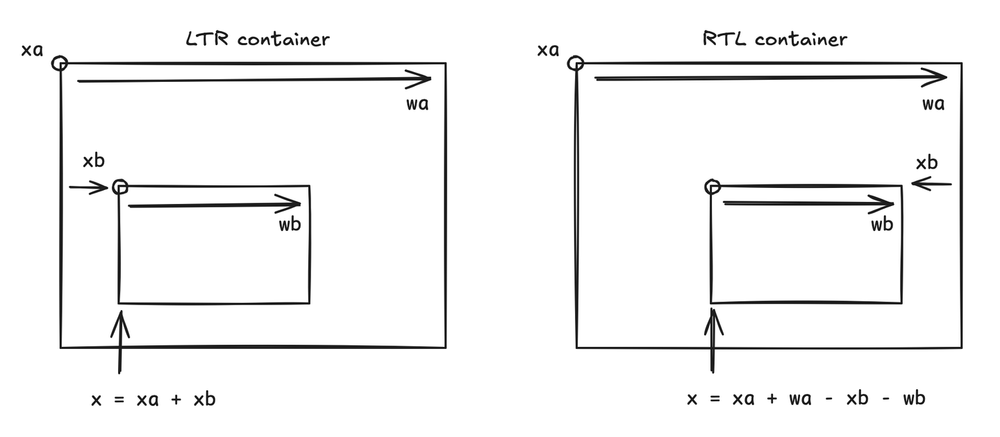

# Right-to-left (RTL) support

Lightning applications may have to be localised for regions where the language is written from right to left, like Hebrew or Arabic. Users expect not only text to be correctly rendered, but also expect the whole application layout to be mirrored. For instance rails would be populated from right to left, and a side navigation on the left would appear on the right instead.

By opposition, the default application layout and text direction is called "left-to-right" (LTR).

RTL support encompasses 2 aspects:

- RTL layout support; which means mirroring the application layout,
- RTL text rendering support; which means accurately rendering (and wrapping) RTL text.

## How RTL layout works

To limit adaption effort for the application developer, Lightning has built-in and transparent support for RTL layout mirroring: leave `x` and flexbox directions as they are for LTR, and they will be interpreted automatically when RTL layout is enabled.

**There is however an important caveat:** in a LTR only application it is often possible to omit specifying a `w` for containers, but for automatic RTL mirroring to function, the widths need to be known, either through an explicit `w` or horizontal flexbox layout.

Here's a simplified diagram of the calculations:

Lightning elements (and components) have a `rtl` property to hint whether the elements children layout should be mirrored.

In practice, setting the application's `rtl` flag will mirror the entire application, as the property is inherited. It is however possible to set some element's `rtl` to an explicit `false` to prevent mirroring of a sub-tree of the application.

### How input works in RTL

A consequence of the choice of transparent mirroring is that the Left and Right key shoud be interpreted in accordance to the layout direction.

This is also automatic, and pressing a Left or Right key will result in the opposite Right or Left key event to be received by components when their layout is mirrored.

### How RTL text works

When the RTL flag is set, text alignement is mirrored, so left-aligned text becomes right-aligned.

But RTL text support also requires to properly wrap text and render punctuation at the right place. Text also may be a combination of RTL and LTR text.

TODO
